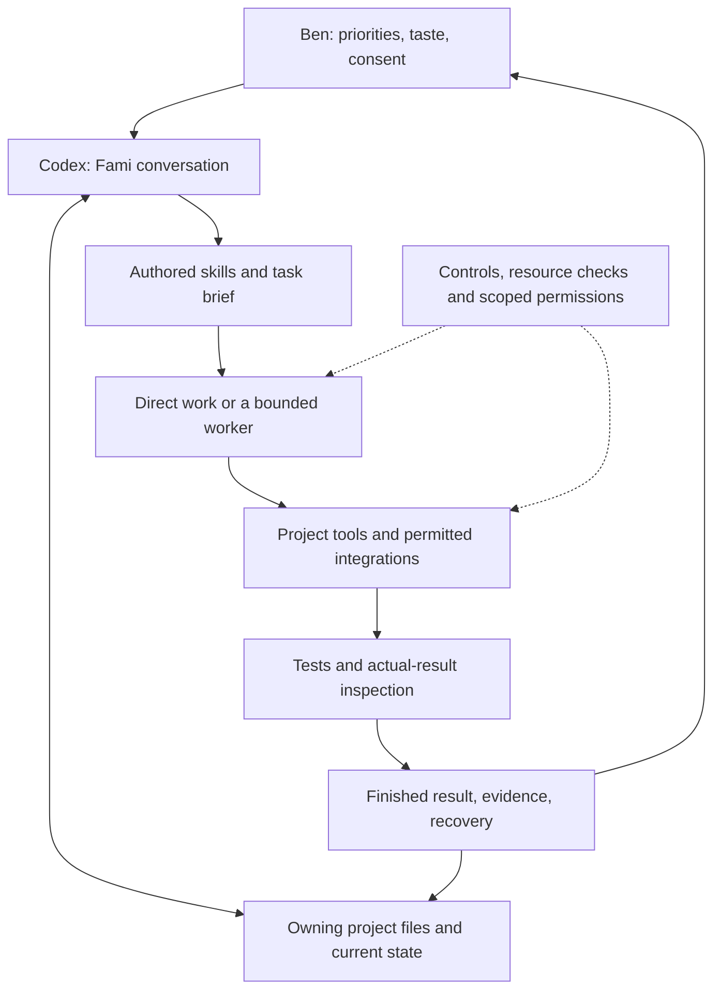

# Architecture

Fami is an orchestration and working-method system around existing model hosts. The central user-facing assistant is the steward; focused workers are temporary production owners, not independent stewards.

## Implemented boundaries

- **Household loop:** `household_loop.py` maintains a local ledger of opportunities, admissions, workers, resource reservations and results. Timeouts do not imply that a worker has stopped. `household_effects.py` checks supported effects and protected paths; fixtures exercise conflict, recovery and denial cases.
- **Controller integration:** `config/controller-guard/` provides OpenClaw hooks for control-file checks, instruction-copy identity, bounded ACP dispatch, result handling, and image-route validation. These hooks apply to that configured integration. They are not a universal security sandbox.
- **Recovery:** Git checkpoints retain project work. The runtime has a SQLite backup helper and a result-snapshot implementation. Live databases, keys, account profiles, and machine snapshots are outside this collection.
- **Gaming guard:** an explicit preflight defers substantial local work while configured game processes are running. It does not retroactively stop arbitrary processes.
- **Discord:** Familiar separates help, character workflows and recording controls. Bardsong shares the voice connection; routing code is included, while bot credentials, server state, captured audio and session transcripts are not.
- **Rookery:** a TypeScript application exposes persistent entries, replies, follows, updates and outcomes through common application logic. It uses Cloudflare/D1. Owner controls and production credentials are not supplied.

## Important limits

The full household worker/effect loop is implemented but its existence does not mean all production routes have been qualified or enabled. The example policy ships with empty grants and unqualified routes. The actual scheduled pilot has narrower permissions than the implementation can represent; its private approvals and live ledger are omitted.

Hosted model selection, subscription access, UI capabilities and scheduling belong to their respective host products. There is no included inference server, proprietary model weight set, or portable recreation of every Codex capability. The OpenClaw/Hermes files illustrate a separate installation-specific path; they do not replace the Codex front door.

The source contains working products, tests, prototypes and methods under continued revision. None of this establishes automatic business income, autonomous financial authority, or professional creative quality without inspecting the individual result.

## Extension pattern

Start with a real recurring need and an authorized outcome. Give it an owning project and a bounded method; decide what evidence demonstrates completion. Add a mechanical check where a concrete failure merits one. Preserve a recoverable baseline, test a relevant failure case, and record what changed. Changes to consent, expenditure, publication, controls or standing permissions remain owner decisions.
